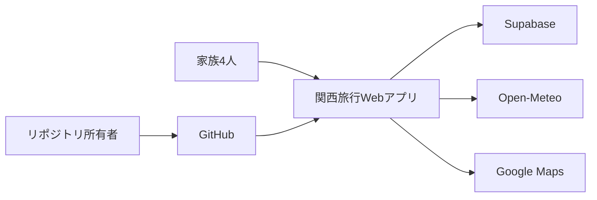
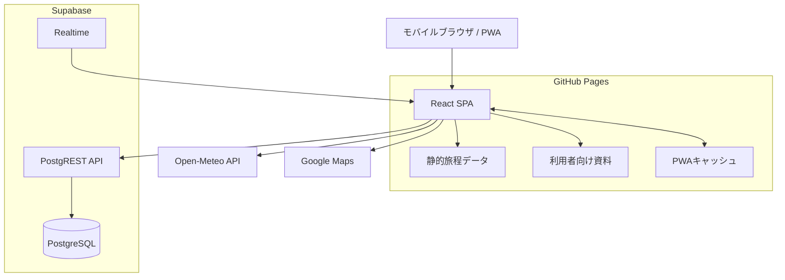

# アーキテクチャ設計書

最終更新日: 2026-07-19

## 1. 設計目標

本システムの最優先品質は、旅行中のスマートフォンから必要情報へ即時に到達できること、通信や外部サービスの障害時にも静的旅程を失わないこと、短期間で保守可能な単純さを維持することである。

## 2. 主要な設計制約

- 配信基盤はGitHub Pagesであり、任意のサーバーサイド処理を持てない。
- UIはReact、TypeScript、Viteで構築する。
- URLはGitHub Pagesのサブパスで配信される。
- 認証を導入せず、旅行参加者がURLから利用できる構成とする。
- 旅程本体はリポジトリ内の静的データとして配布する。
- 変更可能な進捗だけをSupabaseに保存する。
- 外部依存は障害が起こり得る前提で分離する。
- 運用期間は旅行前後を含む短期間とする。

## 3. システムコンテキスト

### 外部主体

| 主体 | 関係 |
|---|---|
| 家族4人 | 旅程確認、進捗更新、資料確認 |
| リポジトリ所有者 | 旅程更新、デプロイ、障害対応、停止 |
| GitHub Pages | SPAと静的アセットの配信 |
| GitHub Actions | テスト、ビルド、デプロイ |
| Supabase | 動的進捗の保存とRealtime配信 |
| Open-Meteo | 天気情報 |
| Google Maps | 地図検索・ナビゲーションへの外部遷移 |

## 4. コンテナ構成

## 5. フロントエンド構造

| パス | 責務 |
|---|---|
| `src/pages/` | 画面単位の構成とユースケース |
| `src/components/` | 再利用可能なUI |
| `src/data/` | 静的旅程 |
| `src/hooks/` | React状態と外部連携の調停 |
| `src/lib/` | APIクライアント、日程計算等 |
| `src/types/` | ドメイン型と境界型 |
| `public/docs/` | 利用者へ配信する旅行資料 |
| `supabase/` | DBスキーマとRLS |
| `.github/workflows/` | CI/CD |

依存方向は、画面から共通UI・hooks・lib・型へ向かう。静的データや純粋ロジックが画面コンポーネントへ依存してはならない。

## 6. ドメインモデル

### 6.1 静的モデル

- `TripDay`: 日付、日番号、概要、エリア、宿泊先、イベント集合
- `TripGroup`: 別行動グループ、構成員、イベント集合
- `TripEvent`: 安定ID、名称、時刻、場所、確定度、説明、地図検索語

### 6.2 動的モデル

- `ProgressRecord`: `event_id`、進捗状態、実績開始・終了、遅延分、メモ、更新日時

静的旅程と動的進捗は `event_id` で結合する。表示名、時刻、説明は変更可能だが、公開済みイベントのIDは原則不変とする。

## 7. 主要実行時フロー

### 7.1 初期表示

1. GitHub PagesからHTML、JavaScript、CSS、静的データを取得する。
2. React RouterがURLハッシュに応じた画面を選択する。
3. 静的旅程を即時表示可能な状態にする。
4. Supabaseが構成済みなら進捗を取得する。
5. 必要な画面で天気を非同期取得する。
6. 外部取得失敗は局所エラーとして処理し、静的表示を継続する。

### 7.2 進捗更新

1. 利用者が状態を選択する。
2. UIを楽観的に更新する。
3. Supabaseへ `event_id` 単位でupsertする。
4. 成功時はサーバー状態を維持する。
5. 失敗時はエラーを表示し、必要に応じて再取得またはロールバックする。
6. 他端末はRealtime通知または再取得で更新を反映する。

### 7.3 現在予定の算出

1. 現在日付に対応する `TripDay` を選ぶ。
2. グループ別、共通、通常イベントを一貫した順序に展開する。
3. 開始・終了時刻を解釈する。
4. 現在時刻を含むイベントを現在予定とする。
5. 該当しない場合は未来の最短イベントを次予定とする。
6. 時刻未定のイベントを誤って現在予定にしない。

### 7.4 オフライン

1. Service Workerが事前に取得したアプリシェルと静的資産を返す。
2. 静的旅程を表示する。
3. Supabase、天気、地図等のオンライン機能は利用不能として扱う。
4. キャッシュ情報が最新とは限らない旨を表示する。

## 8. ルーティング

GitHub Pagesのサブパスおよび直接アクセス時の404回避のためHash Routerを使用する。主要ルートは以下とする。

| ルート | 画面 |
|---|---|
| `#/` | ホーム |
| `#/itinerary` | 旅程 |
| `#/transport` | 交通・宿泊 |
| `#/documents` | 資料 |
| `#/chat` | チャット |

## 9. 外部依存と縮退動作

| 依存 | 正常時 | 障害時 |
|---|---|---|
| GitHub Pages | アプリ配信 | 新規アクセス不能。既存PWAキャッシュがあれば限定利用 |
| Supabase | 進捗保存・同期 | 静的旅程のみ利用。保存失敗を表示 |
| Open-Meteo | 天気表示 | 天気欄のみエラーまたは非表示 |
| Google Maps | 地図表示 | 外部リンク利用不能。場所文字列は維持 |
| Service Worker | オフライン支援 | 通常オンラインWebとして利用 |

## 10. セキュリティモデル

### 10.1 信頼境界

- GitHub Pages上の全静的ファイルは公開情報とみなす。
- ブラウザへ配布される環境変数は秘密情報とみなさない。
- Supabase anon keyは公開可能だが、許可範囲はRLSで制限する。
- 現構成は匿名読み取り・挿入・更新を許すため、URL秘匿を正式な認証とはみなさない。

### 10.2 脅威と対策

| 脅威 | 対策 |
|---|---|
| 第三者による進捗改変 | 保存項目と長さをDB制約で限定、監視、旅行後に匿名更新停止 |
| 機微情報の公開 | リポジトリへ保存しない、別経路で共有 |
| 不正な状態値 | DB enumとTypeScript union |
| 過大な遅延値・メモ | DB CHECK制約 |
| 外部リンク悪用 | アプリ生成の固定URL形式、`noopener` 相当の指定 |
| 古いPWAキャッシュ | 更新通知または再読み込み手順を運用文書化 |

## 11. 品質方針

- **可用性:** 外部依存の障害を静的旅程へ波及させない。
- **使用性:** 現在情報を最優先し、片手操作可能なUIを採る。
- **保守性:** ドメイン型、データ、UI、外部連携を分離する。
- **テスト容易性:** 日程計算等を純粋関数として検証する。
- **性能:** 小規模データをクライアント内で処理し、不要なバックエンド往復を避ける。
- **終了性:** 旅行後に公開・匿名更新を停止できる。

## 12. 既知の制約・技術的負債

- 認証がないため更新者を識別できない。
- 同時更新時の競合解決は最終書き込み優先となる。
- 旅程本体はブラウザから編集できず、コード変更と再デプロイが必要。
- PWAキャッシュの更新伝播は利用端末・ブラウザに依存する。
- 天気情報は補助情報であり、交通機関の公式運行情報ではない。
- チャット機能の責務とデータ保持方針は、実装状況に応じて別途確定する必要がある。
